# Proof of Concept of a Robot Arm Controlled by Light Using Open Source Tools
4th Year Project

**Authors**: Théo Deffrennes, Charles Moulin, Benoît Vidotto

**Polytech Mons (FPMs), UMONS, Belgium**

   <figure align="center">
      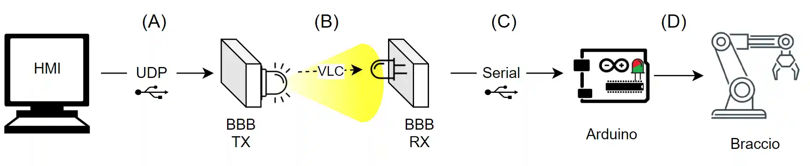
   </figure>

## Introduction

This 4th year's project explores an innovative solution for controlling a robotic arm using Visible Light Communication (VLC). Traditional radio frequency (RF) communication technologies face limitations such as a regulated RF spectrum, interference from other RF communications in industrial environments, and skepticism about RF waves. To address these challenges, we chose to utilize VLC systems, which offer promising advantages.

## Advantages of Visible Light Communication

One of the main benefits of VLC is its high bandwidth, which is unregulated and robust against interference from electromagnetic devices. Additionally, the absence of RF waves provides a more reassuring experience for users. Overall, VLC emerges as a more secure alternative to traditional RF communications.

<figure align="center">
    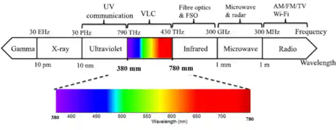
    <figcaption>The high bandwidth of the visible light.</figcaption>
</figure>

## Objective

The primary goal of our project was to demonstrate the feasibility of using VLC to control a robotic arm through open-source tools. We aimed to illustrate the potential of this technology within the industrial sector, aligning with the requirements of Industry 4.0. Concurrently, we examined the IEEE 802.15.13 standard, which addresses high-speed communication in industrial applications.

## Equipment Used

### Visible Light Communication

We employed version 1.3 of OpenVLC for our communication framework. This system facilitates the exchange of data in digital form. At the transmitter end, an electrical signal is converted into a light signal through modulation of a LED's intensity, utilizing On-Off Keying (OOK) for data transmission. On the receiver side, a photodiode transforms the optical signal back into an electrical signal.

### Hardware Components

- **BeagleBone Black (BBB)**: A low-cost open-source board designed for developers and hobbyists, running a Linux operating system.
  
   <figure align="center">
      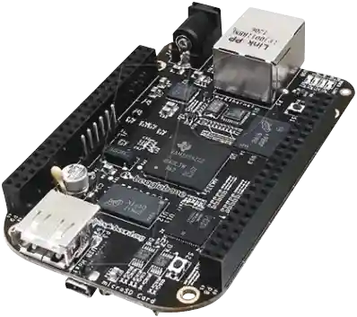
   </figure>
   
- **OpenVLC Cape**: Based on version 1.3, it includes a high-power LED and a photodiode.

  <figure align="center">
      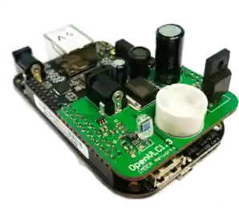
   </figure>
   
- **Robotic Arm**: The Tinkerkit Braccio robot by Arduino, featuring six servo motors and a special cap for the arm.

  <figure align="center">
      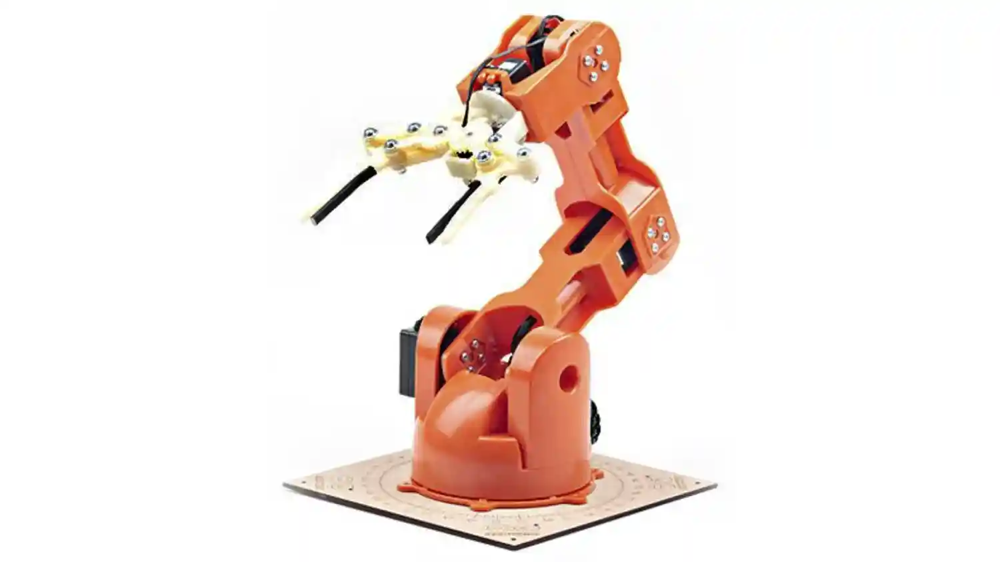
   </figure>
   
- **Arduino Uno**: Central to controlling the robotic arm's movements.
- **RGB LED**: Used for visual feedback during operation.

  <figure align="center">
      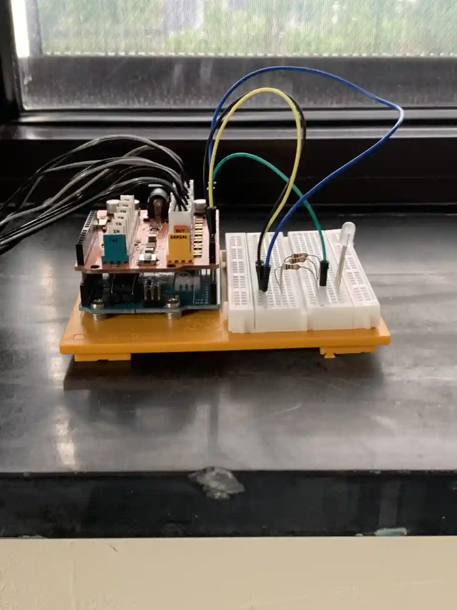
   </figure>

## Architecture

The architecture consists of multiple layers of communication:
  
   <figure align="center">
      
   </figure>

1. **Client-Server Connection via USB**:
   - **GUI**: Sends parameters (angles and speed) as a string and can handle real-time control, saved positions, or sequence movements.
   - **BBB TX**: Acts as the server, retrieving data from the HMI and utilizing the UDP protocol.

2. **Client-Server Connection via VLC**:
   - **BBB TX**: Sends data from the HMI to the BBB RX via a new socket, converting information into bytes as an electrical signal.
   - **BBB RX**: Acts as the server, receiving and processing the transmitted data.

3. **Serial Connection via USB**:
   - **BBB RX**: Formats the received bytes into strings and writes messages to the serial port, with a delay to facilitate Arduino processing.
   - **Arduino**: Controls all servo motors based on received commands, using feedback from the RGB LED to indicate status.
4. **Graphical user interface**:
   - The graphical user interface (GUI) contains information about the robot arm.
   - It allows to control the angles of the different servo-motors in real time.
   - A button has been added to have a shortcut for the rest (safety) position of the arm.
   - Some positions and sequences of movement can be predefined.
   - The GUI has been written in Python using PyQT.

   <figure align="center">
      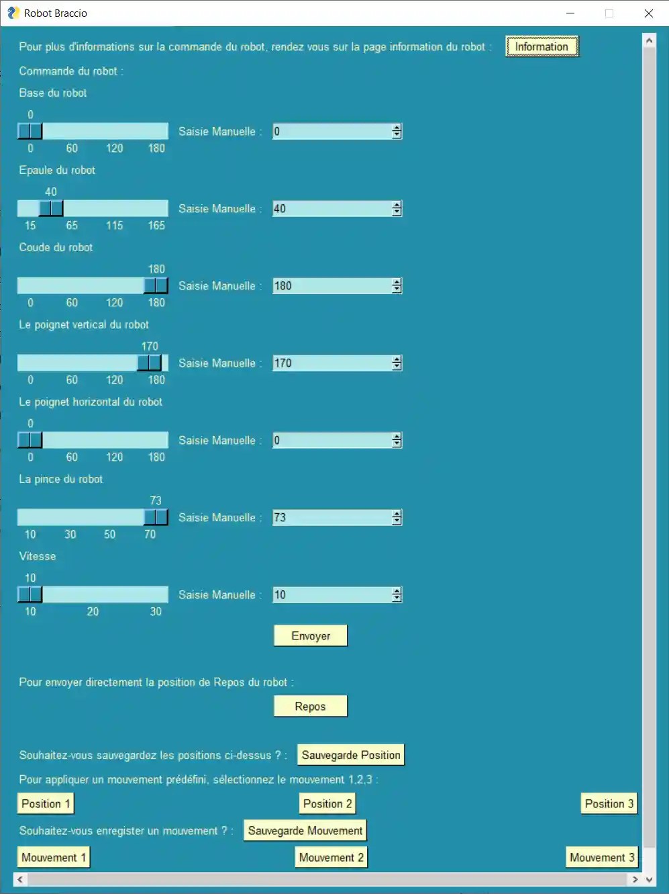
   </figure>

## Demonstration

We conducted a video demonstration showcasing the transmission and control of the robotic arm, including a sequence of movements.

    <video src="https://www.youtube.com/watch?v=3PPUMCAFxhU"  poster="./image33.webp" width="600" autoplay />

    <video src="https://www.youtube.com/watch?v=B2vkbczD8wg"  poster="./image32.webp" width="600" autoplay />

## Tests Performed

### On/Off Parasitic Light

We conducted extensive tests (over 12 hours) to evaluate stability under simulated industrial conditions. The BBB TX was placed on the ceiling, while the BBB RX was positioned on the ground, separated by 1.86 meters. We introduced parasitic light by using a simple incandescent bulb that turned on and off every 20 minutes.
   <figure align="center">
      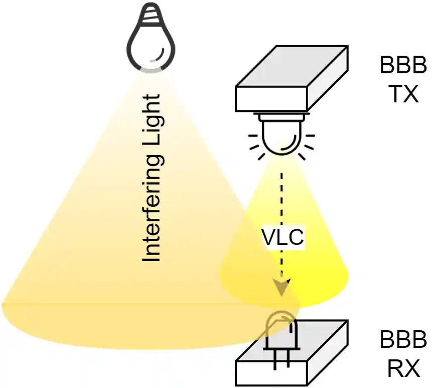
      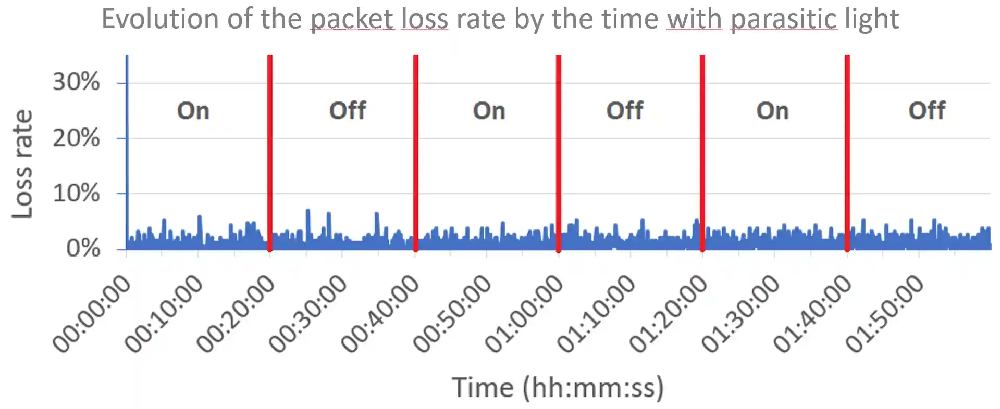
   </figure>
On the previous image, we notice that the OpenVLC is quite reliable with relation to parasitic light.

### Distance Testing

Both BeagleBones were positioned at the same level on the ground. Tests were conducted in darkness, with distances varied every 20 to 30 minutes, demonstrating that distance would not pose a significant problem in an Industry 4.0 scenario.
   <figure align="center">
      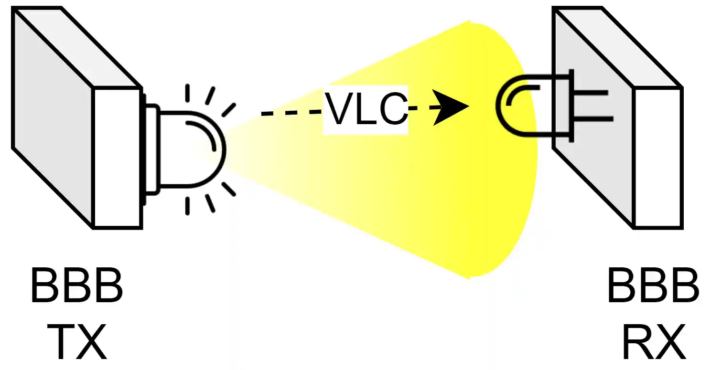
      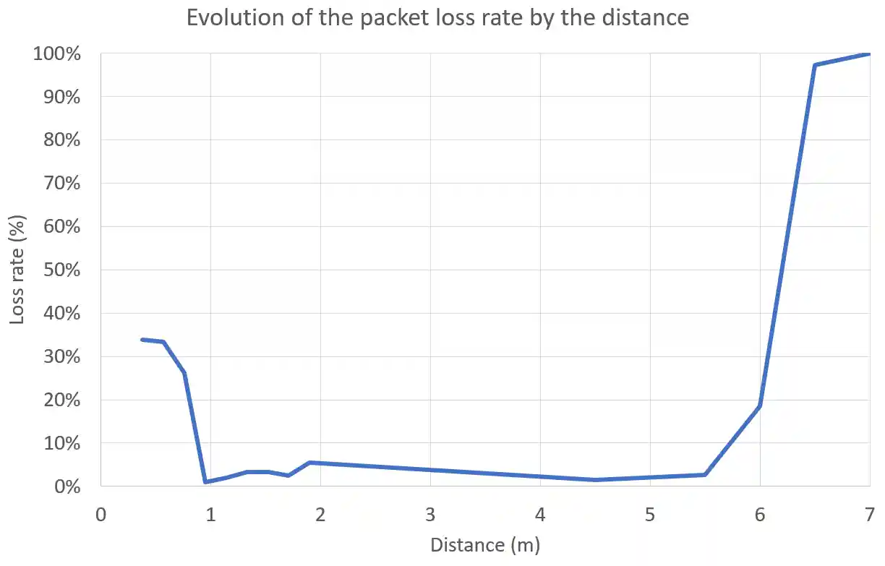
   </figure>
On this image, we can see that the receptor seems to be saturated below one meter and looses too much information over 5.5 meters.

### Throughput Testing

We analyzed throughput in a dim environment with BeagleBones placed horizontally. The maximum throughput was capped at 400 kbit/s, calculated considering the packet loss rate : it is not worth spending the extra energy to go beyon 400 kbit/s. This value seems to be the sweet spot as 350 kbit/s suffers from too much loss.
   <figure align="center">
      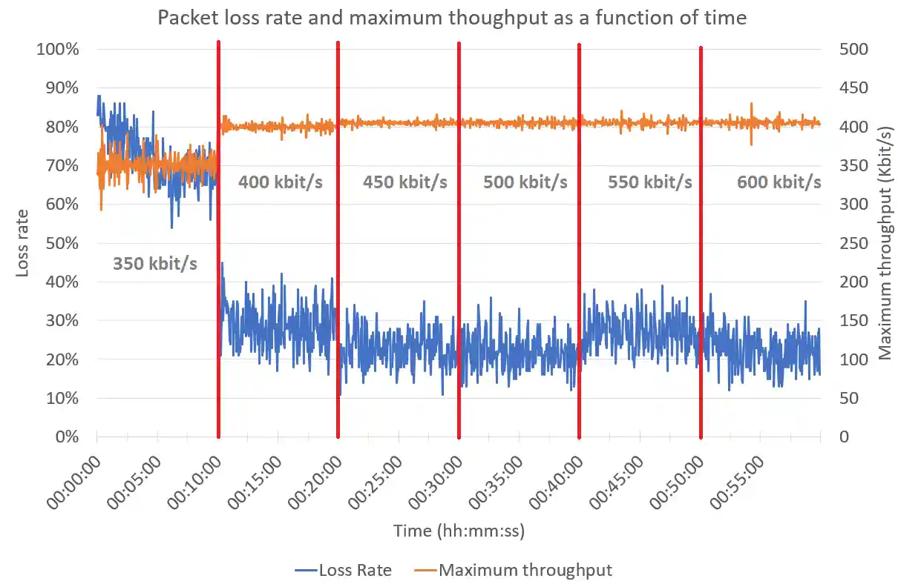
   </figure>

## Challenges

Throughout the project, we encountered several challenges with the BeagleBone boards, including:
- Issues with VLC driver recognition.
- Problems with the VLC cape.
- Difficulties with file management (writing, saving, deleting).
- Recognition issues with the boards by computers.

We used six different BeagleBone boards, noting that packet loss rates varied significantly among them.

## Conclusion

In conclusion, our proof of concept demonstrates that the communication system is operational and fairly robust, handling distance, interfering light, and throughput effectively. However, the reliability remains low, and performance aligns with the manufacturer's specifications.

### Future Improvements

For future iterations, we suggest exploring the use of Li-Fi instead of VLC and implementing error-correcting codes. Additionally, addressing potential interferences between VLC devices and integrating VLC with existing technologies such as Wi-Fi and Bluetooth are crucial for further development.

## Authors & contributors

The original setup of this repository is by [Benoît Vidotto](https://github.com/bvidotto).

## License

MIT License

Copyright (c) 2024 Benoît Vidotto

Permission is hereby granted, free of charge, to any person obtaining a copy
of this software and associated documentation files (the "Software"), to deal
in the Software without restriction, including without limitation the rights
to use, copy, modify, merge, publish, distribute, sublicense, and/or sell
copies of the Software, and to permit persons to whom the Software is
furnished to do so, subject to the following conditions:

The above copyright notice and this permission notice shall be included in all
copies or substantial portions of the Software.

THE SOFTWARE IS PROVIDED "AS IS", WITHOUT WARRANTY OF ANY KIND, EXPRESS OR
IMPLIED, INCLUDING BUT NOT LIMITED TO THE WARRANTIES OF MERCHANTABILITY,
FITNESS FOR A PARTICULAR PURPOSE AND NONINFRINGEMENT. IN NO EVENT SHALL THE
AUTHORS OR COPYRIGHT HOLDERS BE LIABLE FOR ANY CLAIM, DAMAGES OR OTHER
LIABILITY, WHETHER IN AN ACTION OF CONTRACT, TORT OR OTHERWISE, ARISING FROM,
OUT OF OR IN CONNECTION WITH THE SOFTWARE OR THE USE OR OTHER DEALINGS IN THE
SOFTWARE.
